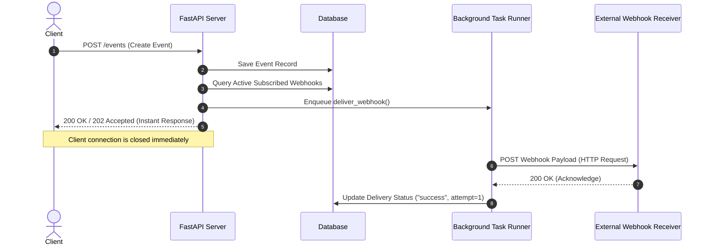

# 🚀 Full-Stack Backend & FastAPI Interview Preparation Guide

This comprehensive reference document covers all core concepts, architecture patterns, subject terminology, and practical commands relevant to modern Python backend engineering, RESTful APIs, FastAPI, Webhooks, and Event-Driven Systems.

---

## 📑 Table of Contents
1. [Core Architectural Concepts](#1-core-architectural-concepts)
   - [REST APIs & HTTP Fundamentals](#rest-apis--http-fundamentals)
   - [WSGI vs. ASGI Architecture](#wsgi-vs-asgi-architecture)
   - [Synchronous vs. Asynchronous Programming](#synchronous-vs-asynchronous-programming)
2. [FastAPI Deep Dive](#2-fastapi-deep-dive)
   - [What makes FastAPI unique?](#what-makes-fastapi-unique)
   - [Dependency Injection & Route Handlers](#dependency-injection--route-handlers)
   - [BackgroundTasks in FastAPI](#backgroundtasks-in-fastapi)
   - [FastAPI vs. Flask vs. Django](#fastapi-vs-flask-vs-django)
3. [Pydantic & Data Modeling](#3-pydantic--data-modeling)
   - [Data Parsing vs. Validation](#data-parsing-vs-validation)
   - [BaseModel & Serialization](#basemodel--serialization)
4. [Webhooks & Event-Driven Systems](#4-webhooks--event-driven-systems)
   - [Polling vs. Webhooks](#polling-vs-webhooks)
   - [The Complete Webhook Delivery Lifecycle](#the-complete-webhook-delivery-lifecycle)
   - [Retry Strategies, Exponential Backoff & Dead Letter Queues (DLQ)](#retry-strategies-exponential-backoff--dead-letter-queues-dlq)
   - [Webhook Security & HMAC Signatures](#webhook-security--hmac-signatures)
   - [Idempotency](#idempotency)
5. [Databases & Supabase (PostgreSQL BaaS)](#5-databases--supabase-postgresql-baas)
   - [Relational Databases & Indexing](#relational-databases--indexing)
   - [BaaS vs. Traditional ORMs (SQLAlchemy vs Supabase Client)](#baas-vs-traditional-orms)
6. [Essential Commands Cheatsheet](#6-essential-commands-cheatsheet)
   - [Python & Virtual Environments](#python--virtual-environments)
   - [Uvicorn & FastAPI Execution](#uvicorn--fastapi-execution)
   - [API Testing with cURL / HTTPie](#api-testing-with-curl--httpie)
   - [Git & Environment Management](#git--environment-management)
7. [Comprehensive Interview Q&A Bank](#7-comprehensive-interview-qa-bank)

---

## 1. Core Architectural Concepts

### REST APIs & HTTP Fundamentals
- **REST (Representational State Transfer)**: An architectural style that relies on stateless, client-server, cacheable communications using standard HTTP protocols.
- **HTTP Verbs / Methods**:
  - `GET`: Retrieve a resource (Safe & Idempotent).
  - `POST`: Create a new subordinate resource (Neither Safe nor Idempotent).
  - `PUT`: Replace an entire existing resource (Idempotent).
  - `PATCH`: Partially update an existing resource (Not necessarily Idempotent, but often implemented as such).
  - `DELETE`: Remove a resource (Idempotent).
- **Idempotence**: An operation is idempotent if making the same request multiple times produces the exact same side-effects on the server as making it once.
- **HTTP Status Code Categories**:
  - `1xx (Informational)`: Request received, continuing process (e.g., `101 Switching Protocols`).
  - `2xx (Success)`: Action successfully received, understood, and accepted (`200 OK`, `201 Created`, `202 Accepted`, `204 No Content`).
  - `3xx (Redirection)`: Further action needed (`301 Moved Permanently`, `304 Not Modified`).
  - `4xx (Client Error)`: Request contains bad syntax or cannot be fulfilled (`400 Bad Request`, `401 Unauthorized`, `403 Forbidden`, `404 Not Found`, `422 Unprocessable Entity`).
  - `5xx (Server Error)`: Server failed to fulfill an apparently valid request (`500 Internal Server Error`, `502 Bad Gateway`, `503 Service Unavailable`, `504 Gateway Timeout`).

### WSGI vs. ASGI Architecture
```
+-------------------------------------------------------------+
|                      WSGI (Synchronous)                     |
|  [Client Request] ---> [Gunicorn/uWSGI] ---> [Flask/Django] |
|  * 1 Request per Thread/Worker (Blocking I/O)               |
+-------------------------------------------------------------+

+-------------------------------------------------------------+
|                      ASGI (Asynchronous)                    |
|  [Client Request] ---> [Uvicorn/Hypercorn] ---> [FastAPI]   |
|  * Single Event Loop handles thousands of concurrent I/O    |
+-------------------------------------------------------------+
```

- **WSGI (Web Server Gateway Interface - PEP 3333)**:
  - Standard interface between web servers and Python web apps.
  - Strictly synchronous. Each concurrent request blocks an entire thread/process during I/O operations (like database queries or HTTP calls).
- **ASGI (Asynchronous Server Gateway Interface)**:
  - The asynchronous successor to WSGI.
  - Allows asynchronous handling of requests (`async`/`await`), WebSockets, HTTP/2, and Server-Sent Events (SSE).
  - Web servers like **Uvicorn** run an async event loop (via `uvloop`) that can service thousands of concurrent requests concurrently on a single thread by yielding during I/O waits.

### Synchronous vs. Asynchronous Programming
- **Synchronous (Blocking)**:
  - Code executes line by line. If a line waits for a database or network response, CPU is idle and the thread is blocked.
- **Asynchronous (Non-blocking)**:
  - Uses an **Event Loop**. When an I/O task is encountered (e.g., calling an external API with `httpx.AsyncClient`), the coroutine yields execution (`await`), allowing the event loop to process other incoming requests while waiting for the I/O to complete.
- **FastAPI Function Definitions**:
  - `async def`: Runs directly on the main event loop. Best for asynchronous non-blocking libraries (`httpx`, `asyncpg`, `aiofiles`).
  - `def` (standard): FastAPI automatically runs standard `def` endpoints in a separate external thread pool to prevent blocking the event loop!

---

## 2. FastAPI Deep Dive

### What makes FastAPI unique?
1. **High Performance**: Powered by Starlette (routing/ASGI) and Pydantic (data validation), rivaling NodeJS and Go in benchmarks.
2. **Automatic Interactive Documentation**: Generates OpenAPI (Swagger UI at `/docs` and ReDoc at `/redoc`) schemas automatically based on Python type hints.
3. **Type Safety & Autocomplete**: Complete editor autocompletion and runtime validation using standard Python 3.10+ type annotations.

### Dependency Injection & Route Handlers
- **Dependency Injection (`Depends`)**:
  - A software design pattern where components declare what they need (DB sessions, authentication, config) rather than instantiating them directly.
  - Allows for clean modularity, code reuse, and seamless mocking during unit tests.

### BackgroundTasks in FastAPI
- FastAPI provides a built-in `BackgroundTasks` class.
- **How it works**:
  - It runs tasks *after* sending the HTTP response back to the client.
  - Ideal for lightweight operations (e.g., sending an email notification, writing an audit log, firing an event).
- **BackgroundTasks vs. Distributed Message Queues (Celery/RQ/RabbitMQ)**:
  - `BackgroundTasks`: Runs in the same process/memory space. If the server crashes or restarts, unexecuted tasks are lost.
  - `Celery + Redis/RabbitMQ`: Distributed task queue with persistence, worker scaling, retries across instances, rate limiting, and monitoring.



---

## 3. Pydantic & Data Modeling

### Data Parsing vs. Validation
- Pydantic is not just a validator; it is primarily a **data parser**.
- If a field is typed as `int` and `"123"` (string) is supplied, Pydantic automatically parses and converts it into the integer `123`.
- If invalid data is supplied, it returns structured 422 errors detailing the exact field, location, and reason.

### BaseModel & Serialization
```python
from pydantic import BaseModel, HttpUrl, Field

class WebhookCreate(BaseModel):
    url: str
    event_type: str = Field(..., example="order.created")
    is_active: bool = True
```
- **Key Methods**:
  - `.model_dump()` (Pydantic v2) / `.dict()` (Pydantic v1): Convert model to standard Python dictionary.
  - `.model_dump_json()` / `.json()`: Convert model to JSON string.
  - `model_validate(obj)` / `parse_obj(obj)`: Instantiates a model from a dictionary or ORM object.

---

## 4. Webhooks & Event-Driven Systems

### Polling vs. Webhooks
| Feature | Polling (Pull Architecture) | Webhooks (Push Architecture) |
| :--- | :--- | :--- |
| **Mechanism** | Client repeatedly calls Server API at regular intervals (`GET /data`) | Server pushes HTTP POST payload to Client URL as soon as the event happens |
| **Latency** | High (bounded by polling interval) | Real-time / Near zero latency |
| **Resource Usage** | Wasteful (90%+ of requests return empty changes) | Highly efficient (network traffic only occurs upon state change) |
| **Setup Complexity**| Simple for client | Requires client to expose a public, secure endpoint |

### The Complete Webhook Delivery Lifecycle
1. **Event Occurrence**: A domain event happens (e.g., `payment.success`, `user.registered`).
2. **Fan-Out / Subscription Resolution**: Find all active webhook URLs registered for this specific `event_type`.
3. **Delivery Attempt**: Dispatch an HTTP POST request containing the event payload to the target URL with a strict timeout (e.g., 5 seconds).
4. **Result Logging**: Record delivery status (`pending`, `success`, `failed`), HTTP response status code, and attempt count.

### Retry Strategies, Exponential Backoff & Dead Letter Queues (DLQ)
- **Immediate Retries**: Trying 3 times immediately back-to-back can overwhelm a recovering server.
- **Exponential Backoff**: Increasing delay between subsequent retry attempts:
  $$\text{Delay} = \text{Initial Delay} \times 2^{\text{attempt}}$$
  *(e.g., Attempt 1: 5s, Attempt 2: 10s, Attempt 3: 20s, Attempt 4: 40s)*.
- **Jitter**: Adding random small time variations to avoid "Thundering Herd" problems where hundreds of failed webhooks retry at the exact same millisecond.
- **Dead Letter Queue (DLQ)**: Once max retries are exhausted, the failed event is routed to a DLQ for manual inspection or dead-letter alerting.

### Webhook Security & HMAC Signatures
How does a webhook receiver verify that an incoming HTTP POST request actually came from our server and was not forged or altered by an attacker?

```
[Payload JSON] + [Shared Secret Key] ---> SHA-256 HMAC Hash ---> Sent in 'X-Signature-SHA256' Header
```

**Implementation Pattern**:
1. Sender & Receiver share a secret key (`WEBHOOK_SECRET`).
2. Sender computes an **HMAC-SHA256** hash of the raw JSON request body using the secret key.
3. Sender puts the signature in the headers: `X-Signature: <hex_digest>`.
4. Receiver calculates the exact same HMAC-SHA256 on the raw received bytes using their shared secret.
5. Receiver performs a constant-time string comparison (`hmac.compare_digest()`) to prevent **Timing Attacks**.

### Idempotency
- Because network blips or retries can cause the same webhook payload to be sent multiple times, webhook consumers must be **idempotent**.
- **How to handle**: Send a unique `idempotency_key` or `event_id` in the webhook payload. The receiver checks if that `event_id` was already processed before applying business logic.

---

## 5. Databases & Supabase (PostgreSQL BaaS)

### Relational Databases & Indexing
- **Tables & Relationships**:
  - `webhooks`: Stores endpoint configurations (`id`, `url`, `event_type`, `is_active`, `secret`).
  - `events`: Stores event records (`id`, `event_type`, `payload`, `created_at`).
  - `deliveries`: Join table / audit trail (`id`, `webhook_id`, `event_id`, `status`, `response_code`, `attempt_count`).
- **Indexes**: Essential on frequently filtered columns (`event_type`, `is_active`, `event_id`) to maintain $O(\log N)$ lookup performance instead of full table scans $O(N)$.

### BaaS vs. Traditional ORMs
- **Supabase / PostgREST Client**: Communicates with PostgreSQL through secure RESTful endpoints using API keys and Row Level Security (RLS).
- **SQLAlchemy / Tortoise ORM**: Directly manages a TCP connection pool to PostgreSQL, generating raw SQL queries.

---

## 6. Essential Commands Cheatsheet

### Python & Virtual Environments
```bash
# Create a virtual environment
python -m venv .venv

# Activate virtual environment
# Windows (PowerShell):
.venv\Scripts\Activate.ps1
# Windows (CMD):
.venv\Scripts\activate.bat
# Linux/macOS:
source .venv/bin/activate

# Install requirements
pip install -r requirements.txt

# Freeze current dependencies
pip freeze > requirements.txt
```

### Uvicorn & FastAPI Execution
```bash
# Run FastAPI application with auto-reload (development)
uvicorn main:app --reload --port 8000

# Run on all network interfaces (host 0.0.0.0)
uvicorn main:app --host 0.0.0.0 --port 8000 --reload

# Production execution with multiple worker processes
uvicorn main:app --host 0.0.0.0 --port 8000 --workers 4

# Run receiver on a different port
uvicorn webhook_receiver:app --reload --port 8001
```

### API Testing with cURL / HTTPie

#### 1. Register a Webhook
```bash
curl -X POST "http://localhost:8000/webhooks" \
     -H "Content-Type: application/json" \
     -d "{\"url\": \"http://localhost:8001/webhook\", \"event_type\": \"payment.success\", \"is_active\": true}"
```

#### 2. Trigger an Event (Fan-out)
```bash
curl -X POST "http://localhost:8000/events" \
     -H "Content-Type: application/json" \
     -d "{\"event_type\": \"payment.success\", \"payload\": {\"order_id\": \"ORD_9912\", \"amount\": 49.99, \"currency\": \"USD\"}}"
```

#### 3. Inspect Deliveries
```bash
curl -X GET "http://localhost:8000/deliveries"
```

### Git & Environment Management
```bash
# Ensure sensitive files are not committed
echo ".env" >> .gitignore
echo ".venv/" >> .gitignore
echo "__pycache__/" >> .gitignore

# Basic Git Flow
git init
git add .
git commit -m "feat: implement event-driven webhook engine"
```

---

## 7. Comprehensive Interview Q&A Bank

### 💡 Category 1: FastAPI & Asynchronous Python

#### Q1: How does FastAPI achieve high performance compared to Flask or Django?
> **Answer**: FastAPI is built directly on top of **Starlette** (an ASGI framework) and **Pydantic** (compiled with Rust in v2). Unlike WSGI frameworks (like standard Flask or Django) that process requests synchronously in blocking threads, FastAPI uses Python's asynchronous event loop (`asyncio`). It can pause execution during network or database I/O waits and handle other requests concurrently without thread-switching overhead.

#### Q2: What happens when you define an endpoint with `def` vs `async def` in FastAPI?
> **Answer**:
> - If you declare `async def`, FastAPI runs it directly inside the main ASGI event loop thread. You must not run blocking code inside it (e.g., `time.sleep()` or synchronous database calls), or you will freeze the entire server.
> - If you declare standard `def`, FastAPI automatically offloads that function to an internal **thread pool** (using `anyio`) and awaits its completion, preventing standard synchronous code from blocking the event loop.

#### Q3: What is the purpose of `BackgroundTasks` in FastAPI, and when should you NOT use it?
> **Answer**: `BackgroundTasks` executes a function after sending the HTTP response back to the client. It is suited for quick, in-process tasks like sending an email or emitting an audit record.
> **When NOT to use it**: Do not use it for critical, CPU-heavy, or long-running workflows. If the application server process crashes, runs out of memory, or restarts, any pending `BackgroundTasks` will be permanently lost because they exist only in memory without a persistent broker. Use **Celery**, **ARQ**, or **Redis Streams** for durable task queues.

---

### 💡 Category 2: Webhooks & Event-Driven Architecture

#### Q4: What is the difference between an API and a Webhook?
> **Answer**:
> - An **API** is a request-response mechanism where the client initiates communication (Pull).
> - A **Webhook** is an automated reverse-API where the server pushes real-time notifications to a client's pre-configured URL when a specific event occurs (Push).

#### Q5: How do you prevent replay attacks and verify data integrity in Webhooks?
> **Answer**:
> 1. **HMAC Signature**: The sender hashes the request payload with a shared secret key using HMAC-SHA256 and includes it in a header (`X-Signature`). The receiver computes the hash on the raw payload and verifies it using constant-time comparison (`hmac.compare_digest`).
> 2. **Timestamp Header**: The sender adds an `X-Timestamp` header in the signed payload. The receiver rejects any request where `current_time - timestamp > threshold` (e.g., 5 minutes) to defeat replay attacks.

#### Q6: Why is idempotency critical for webhook receivers?
> **Answer**: In distributed systems, network drops or timeouts can lead to retried delivery attempts (at-least-once delivery guarantee). If a payment success webhook is delivered twice, an idempotent receiver checks an `event_id` in a database/cache before executing logic to prevent charging a user twice or sending duplicate products.

#### Q7: What is an Exponential Backoff retry strategy?
> **Answer**: An algorithm that exponentially multiplies the delay between failed request retries (e.g., $1s, 2s, 4s, 8s, 16s...$) combined with randomized jitter. This gives failing downstream servers time to recover and prevents the sender from causing a Denial of Service (DoS) storm on the receiver.

---

### 💡 Category 3: HTTP, REST, and Status Codes

#### Q8: What is the difference between `PUT` and `PATCH`?
> **Answer**:
> - `PUT` replaces the entire target resource with the requested representation (missing fields are reset to default/null). It is idempotent.
> - `PATCH` applies partial modifications to a resource (only provided fields are changed).

#### Q9: What is HTTP Status Code 422 Unprocessable Entity?
> **Answer**: HTTP 422 indicates that the server understands the content type of the request payload and the syntax is correct, but was unable to process the contained instructions due to semantic validation errors (e.g., missing required field or wrong data type in Pydantic).

#### Q10: What is the difference between 401 Unauthorized and 403 Forbidden?
> **Answer**:
> - `401 Unauthorized`: Authentication is required and has failed or has not yet been provided ("Who are you?").
> - `403 Forbidden`: The server understands who the user is, but refuses authorization because the user lacks necessary permissions ("I know who you are, but you cannot access this").

---

### 💡 Category 4: System Design & Production Deployment

#### Q11: How do you scale a FastAPI application in production?
> **Answer**:
> 1. **Process Manager / ASGI Server**: Run Uvicorn workers managed by Gunicorn (`gunicorn main:app -w 4 -k uvicorn.workers.UvicornWorker`).
> 2. **Containerization & Orchestration**: Containerize using Docker and deploy to Kubernetes or AWS ECS with Horizontal Pod Autoscaling (HPA) based on CPU/Request count.
> 3. **Reverse Proxy & Load Balancer**: Place NGINX, Traefik, or AWS ALB in front for SSL termination, rate limiting, and round-robin traffic distribution.
> 4. **Database Connection Pooling**: Use PgBouncer or Supabase connection pooling to prevent overwhelming PostgreSQL connections.
> 5. **Async Worker Separation**: Decouple webhook delivery logic into dedicated background worker services communicating via Redis or RabbitMQ queues.

---
*Created for Python Backend, FastAPI, and Event-Driven Systems Interview Preparation.*
